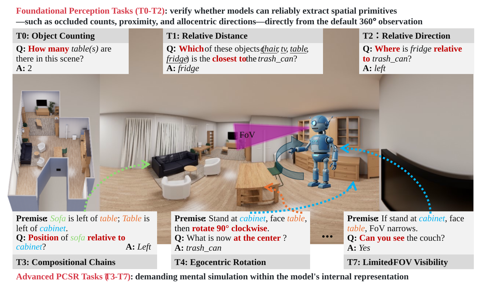
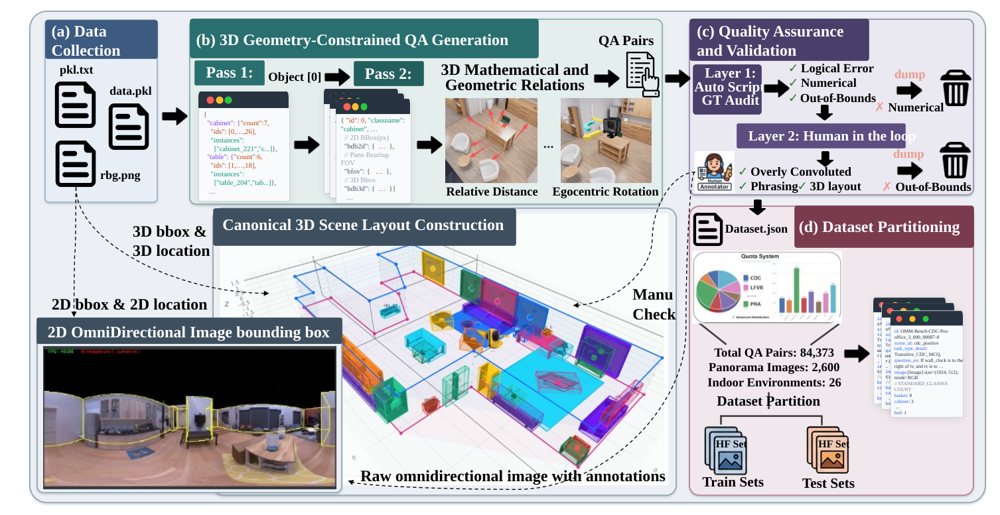
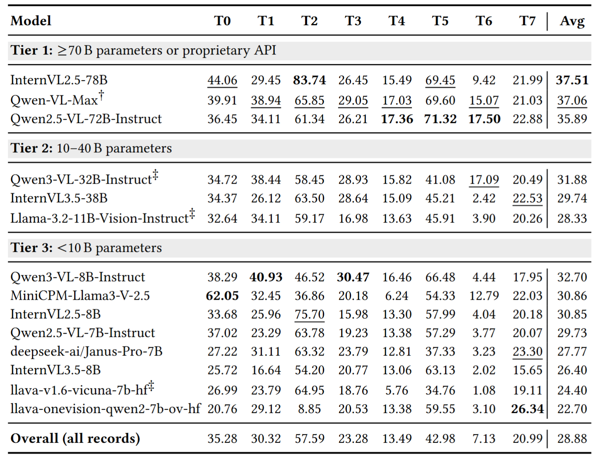

# PCSR-Benchmark
Code release for Beyond Localization: A Comprehensive Benchmark of Perspective-Conditioned Spatial Reasoning in MLLMs from Omnidirectional Images [ACMMM 2026]

<div align="center">

# Beyond Localization: A Comprehensive Benchmark of Perspective-Conditioned Spatial Reasoning in MLLMs from Omnidirectional Images
## A Comprehensive Benchmark of Perspective-Conditioned Spatial Reasoning



<br>

[](https://arxiv.org/abs/xxxx.xxxxx)
[](https://your-project-page.github.io/)
[](https://huggingface.co/datasets/your-dataset)
[](https://github.com/yourname/yourrepo)

**Yuangong Chen**<sup>1</sup>,
**Waikeung Wong**<sup>1†</sup>,
**Jiaxing Li**<sup>2</sup>,
**Ioannis Patras**<sup>3</sup>,
**Xu Zheng**<sup>4</sup>

<sup>1</sup>The Hong Kong Polytechnic University, Hong Kong SAR, China &emsp;
<sup>2</sup>Guangzhou University, Guangzhou, China &emsp;
<sup>3</sup>Queen Mary, University of London, London, United Kingdom &emsp;
<sup>4</sup>Great Bay University, Dongguan, China

<br>
<sup>†</sup>Corresponding author

</div>


## News
- `2026-07-30` Release evaluation code and benchmark.
- `2026-07-10` Paper accepted by ACM MM 2026.

## 📖 Abstract

Understanding spatial relationships from omnidirectional (360°) images is a fundamental challenge for Multimodal Large Language Models (MLLMs), yet existing benchmarks largely focus on object localization while overlooking the **perspective-conditioned** nature of spatial reasoning. In this work, we introduce **PCSR-Benchmark**, a comprehensive benchmark designed to evaluate MLLMs on perspective-conditioned spatial reasoning tasks from omnidirectional images. Our benchmark covers *(1)* egocentric and allocentric reasoning, *(2)* multi-view consistency, and *(3)* fine-grained relational understanding across diverse indoor and outdoor scenes. We evaluate a wide range of state-of-the-art open-source and proprietary MLLMs, revealing that current models exhibit substantial limitations when reasoning beyond simple localization. We further provide detailed analyses on failure modes and propose insights for developing next-generation spatially-aware MLLMs. We hope PCSR-Benchmark will serve as a rigorous testbed to advance research on spatial reasoning in omnidirectional visual understanding.


## Contents
- [Overview](#overview)
- [Benchmark](#benchmark)
- [Method](#method)
- [Results](#results)
- [Quick Start](#quick-start)
- [Installation](#installation)
- [Evaluation](#evaluation)
- [Citation](#citation)

## Overview
**Motivation.** Existing work focuses on xxx, but ignores xxx.

**Our contribution.**
- We introduce ...
- We benchmark ...
- We show ...


## Benchmark
 we introduce PCSR-Bench, a benchmark designed to test whether models can recompute spatial relations under changed observer conditions.



## Installation
We evaluate on xxx under xxx setting.




## Evaluation
Load the dataset:

```python
from datasets import load_dataset
dataset = load_dataset("your-name/your-dataset")
print(dataset)
```

### Running inference with `run_bench.py`

All 19 model configurations are dispatched through a single CLI entry point.
The table below maps each original v12 inference script to its new command.

| Original script                                  | New command |
|---|---|
| `Qwen2_5_VL_7B_Instruct_v12.py`                  | `python run_bench.py --model qwen2_5_vl_7b` |
| `Qwen2_5_VL_72B_Instruct_v12.py`                 | `python run_bench.py --model qwen2_5_vl_72b` |
| `Qwen3_VL_8B_Instruct_v12.py`                    | `python run_bench.py --model qwen3_vl_8b` |
| `Qwen3_VL_32B_Instruct_v12.py`                   | `python run_bench.py --model qwen3_vl_32b` |
| `InternVL2_5_8B_v12.py`                          | `python run_bench.py --model internvl2_5_8b` |
| `InternVL2_5_38B_v12.py`                         | `python run_bench.py --model internvl2_5_38b` |
| `InternVL2_5_78B_v12.py`                         | `python run_bench.py --model internvl2_5_78b` |
| `InternVL3_5_8B_v12.py`                          | `python run_bench.py --model internvl3_5_8b` |
| `InternVL3_5_38B_v12.py`                         | `python run_bench.py --model internvl3_5_38b` |
| `MiniCPM_V_2_5_v12.py`                           | `python run_bench.py --model minicpm_v_2_5` |
| `LLaVA_OneVision_7B_v12.py`                      | `python run_bench.py --model llava_onevision_7b` |
| `LLaVA_v1_6_7B_v12.py`                           | `python run_bench.py --model llava_v1_6_7b` |
| `LLaVA_v1_6_7B_v12_hotfix18.py`                  | `python run_bench.py --model llava_v1_6_7b --no-bos` |
| `Llama_3_2_11B_Vision_Instruct_v12.py`           | `python run_bench.py --model llama_3_2_11b_vision` |
| `Llama_3_2_11B_Vision_Instruct_v12_hotfix18.py`  | `python run_bench.py --model llama_3_2_11b_vision --no-bos` |
| `Janus_Pro_7B_v12.py`                            | `python run_bench.py --model janus_pro_7b` |
| `Qwen_VL_Max_API_v12.py`                         | `python run_bench.py --model qwen_vl_max_api --api-mode legacy` |
| `Qwen_VL_Max_API_v12_hotfix18.py`                | `python run_bench.py --model qwen_vl_max_api --api-mode fixed` |

### Common CLI Overrides

Any of the following flags can be appended to a `run_bench.py` command to override the
corresponding default value from `configs/models.yaml` — no YAML edit is required.

| Argument             | Description |
|---|---|
| `--model-path`       | Override the model checkpoint path (local directory or HF repo id). |
| `--output`           | Override the JSONL output path where per-sample results are appended. |
| `--data-path`        | Override the QA JSON path (default `/root/autodl-fs/OMM-Bench_Positive_QA_v1_8_test.json`). |
| `--image-dir`        | Override the image directory (default `/root/autodl-fs/ReplicaPano_test`). |
| `--batch-size`       | Override the per-step batch size used by the runner loop. |
| `--tp`               | lmdeploy tensor-parallel size (e.g. `--tp 4` for 72B / 78B models). |
| `--cuda-visible`     | Value for `CUDA_VISIBLE_DEVICES` (use `""` for the API-only backend). |
| `--torch-dtype`      | dtype for HuggingFace backends (e.g. `float16`, `bfloat16`). |
| `--add-bos` / `--no-bos` | Whether LLaVA-Next / Mllama prepends a BOS token (aligned with v12 vs hotfix18). |
| `--api-mode`         | DashScope backend mode: `legacy` (original v12), `fixed` (hotfix18), or `openai` (OpenAI-compatible endpoint). |
| `--api-key`          | DashScope API key. Can also be set via the `DASHSCOPE_API_KEY` environment variable. |
| `--max-img-size`     | Upper bound (in pixels) applied to images before API upload. |
| `--max-new-tokens`   | Maximum number of generated tokens (default `512`). |

**Examples**

```bash
# 78B run with custom tensor-parallel size and output path
python run_bench.py --model internvl2_5_78b --tp 8 \
    --output /root/autodl-tmp/InternVL2_5_78B_v12_run2.json

# Reproduce the hotfix18 variant of LLaVA-v1.6 (no BOS token)
python run_bench.py --model llava_v1_6_7b --no-bos

# DashScope API version against a different image directory
export DASHSCOPE_API_KEY=sk-xxxx
python run_bench.py --model qwen_vl_max_api --api-mode fixed \
    --image-dir /root/other_image_root
